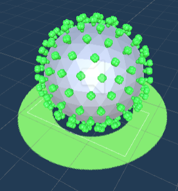
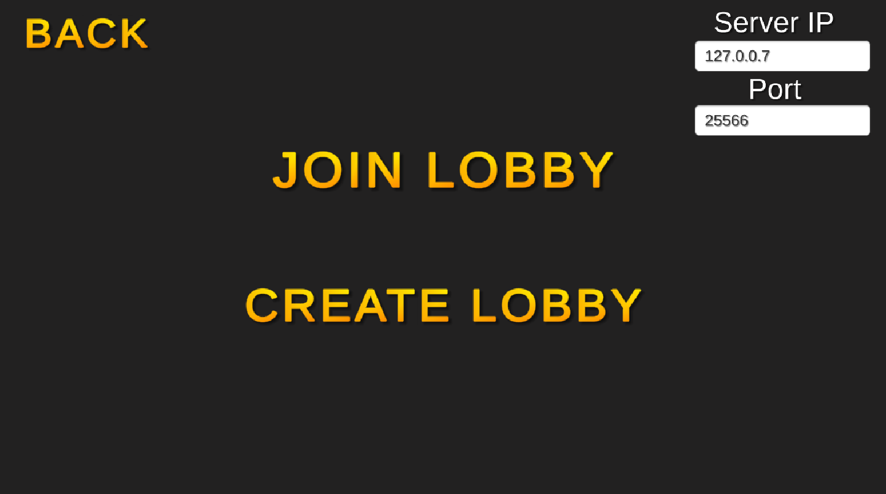
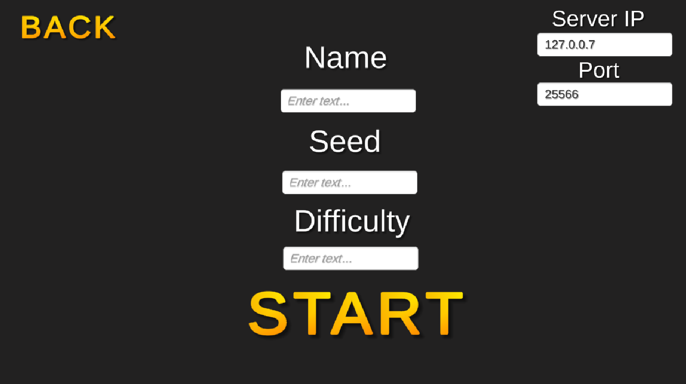
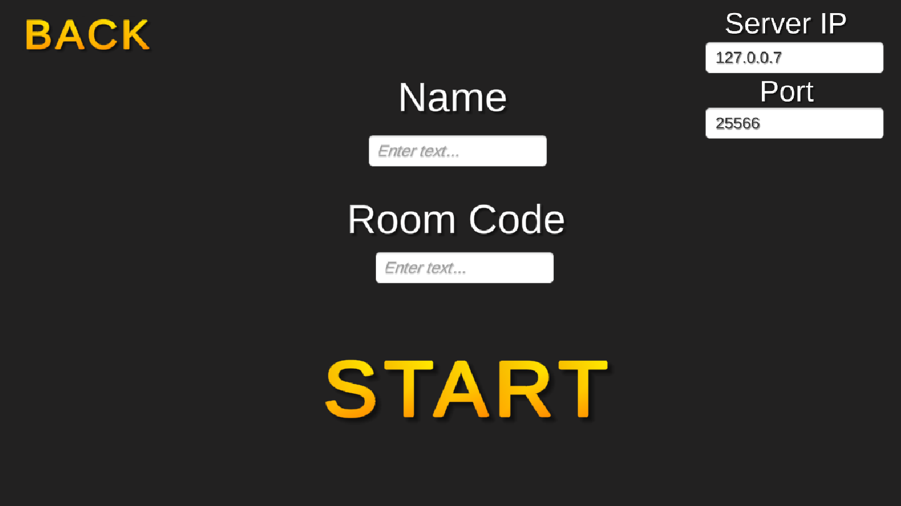

# Rogue Virus
Created by Landen Love, Alex Fedor, Riley Smith, and Mulualem Hailom.

## What is Rogue Virus?

Rogue Virus was a senior inquiry project at Augustana College for CSC-490. It is a player versus player rogue-like. This means that dungeons are randomly generated by a given seed. In order to win, one player must achieve a higher score than the other player. If both players share the same score, the one with the fastest time wins.

The player is represented by a white blood cell. The player earns points by defeating enemy virus cells. There are also items that the player can pickup to give them an advantage.
 
# Setup instructions

You can find the game files on the [Releases](https://github.com/AugustanaCSC490Spring2021/shoveler-repo/releases) page. There are builds for Windows, MacOS, and Linux.

Because Rogue Virus is a player vs player game, you will also need one person to host the game management server. This was originally hosted on a google cloud VM, but we have since ran out of credits. The server runs on Java, and you can find the compiled jar file [Here](https://github.com/AugustanaCSC490Spring2021/shoveler-repo-server/releases)

# How to play
## Controls
WASD - Controls player movement

E - interact with doors and exit. Doors unlock once the current room has been cleared of enemies

Left click - Melee attack

## Enemy types
There are three enemy types

### Goomba Virus

This virus mindlessly runs after the player like a Goomba.

### Guard Virus

This virus stays in one area until it "sees" the player. Once the player is seen, it will chase the player.

### Patrol Virus

This virus patrols between two points until it "sees" the player. Once the player is seen, it will chase the player.

# Creating lobbies
## The Main Menu

To create a new lobby, one player becomes the host and the other a client.

## The Host

The host sets the seed that is used for random room generation. The difficulty determines how many rooms are created and how far away the exit is. Lower numbers such as 1-3 are recommended for new players. Once the lobby is created, the host is given a 4 digit code they can share with the client.

## The Client

The client enters the room code and the game begins at the same time for both players.